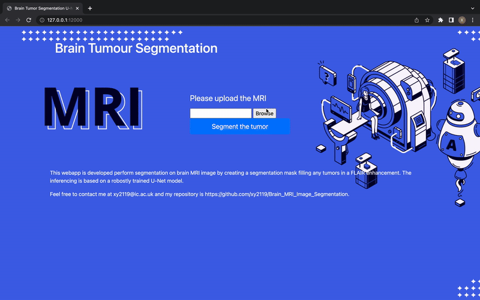
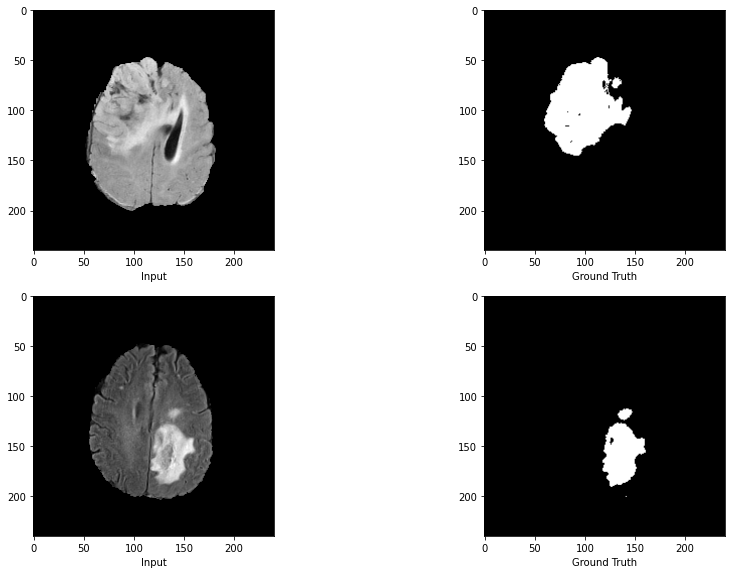

# Brain MRI Image Segmentation
## 🏆 Winner Of The 2021 Imperial College Data Science Challenge

In the [2021 Data Science Institute Computer Vision Challenge](https://www.imperial.ac.uk/data-science/),  we applied semantic image segmentation techniques on magnetic resonance imaging (MRI) to aid the diagnosis of brain tumours. [Prof. Yike Guo](https://www.imperial.ac.uk/people/y.guo), the co-director of the Data Science Institute (DSI), and the DSI judging panel awarded this work as the winner of **"Best Computer Vision Project"**. Since our model achieved the highest dice score (78%) in the testing tasks, which uses U-Net architecture with pre-trained VGG16, and was trained on 90% of the available data.

<!-- ABOUT THE PROJECT -->
<h2 id="about-the-project"> :pencil: About The Project</h2>

**To provide solutions for real-world applications**, I further developed it into a **Tumor Segmentation API** that could be accessed by **doctors and clinicians for effective screening and diagnosis**.

## Dataset
The dataset of brain MRIs from patients with glioma, examples of MRI images are on the left and  on the right are corresponding masks which have been marked by the doctor. The dataset can be downloaded from Google Drive [URL](https://drive.google.com/drive/folders/1Y4MUrrfT-Xuos83nOnq8ZWTMZmp9qADH?usp=sharing).

<!-- PREREQUISITES -->

  
  

<!--This project is written in Python programming language.  -->
The following open source packages are used in this project:
* Numpy
* Pandas
* Matplotlib
* Scikit-Learn
* Pytorch
* TensorFlow
* Keras
* Flask

<h2 id="folder-structure"> Folder Structure</h2>

    code
    .
    ├── images                                  # path to store images in tiff png gif
    ├── notebooks                               
    │   ├── TumorSeg_Winner_U_Net_VGG16.ipynb   # notebook to train VGG16 U-Net      
    │   ├── TumorSeg_API_U_Net_VGG19.ipynb      # notebook to train VGG19 U-Net 
    │   └── README.md    
    │
    ├── static                  
    │   ├── css         
    │   ├── img                         # path to store uploaded images
    │   ├── js          
    │   └── Pred.png 
    │
    ├── templates                       # tempaltes for webapp development
    │   ├── index.html
    │
    ├── api.py                          # API depolyment using Flask
    ├── test.py
    ├── requirements.txt
    └── README.md

## 🎯 RoadMap
### Model Training

0. Upload `Dataset` to Google Drive, dataset can be found [here](https://drive.google.com/drive/folders/1Y4MUrrfT-Xuos83nOnq8ZWTMZmp9qADH?usp=sharing).
---
1. (Optional) Create an account on [Weights & Biases](https://wandb.ai/site) platform (The training is tracked by `wandb`, this is a tool for tracking and visualising machine learning experiments in real time. If you have an account on Weights & Biases, get started by copying the profile API key and pasting it later in the notebook as requested) 
---
2. Open [notebook](./notebooks/TumorSeg_Winner_U_Net_VGG16.ipynb) in Google Colab 
---
###  API Development 

3. Clone this repository, open a terminal and navigate to the directory to write the command
    code
    .
    git clone https://github.com/xy2119/Brain_MRI_Image_Segmentation.git 
    cd Brain_MRI_Image_Segmentation

4. Create and set up the environment `tumorseg`
    conda create --name tumorseg --file requirements.txt

5. Activate `tumorseg` environment 
>
> conda activate tumorseg
> 
---
6. Move trained model to the current directory. You are welcomed to deploy your own model, or download mine :) [unet_vgg19.h5](https://drive.google.com/file/d/1TElZ-XPhn0Vc41nLx2NJMYaR8CSbhbB1/view?usp=sharing) <-- testset dice score~81% trained from [here](./notebooks/TumorSeg_API_U_Net_VGG19.ipynb)
---
8. Run `api.py` script and visit the web address to try out the segmenting functions!
>
> python api.py
> 
---

## Future Work
Exploring more advanced segmentation models, including SEP and FCBFormer on the leaderboard of paperwithcode.

## Contributing
If you have any questions or advice towards this repository, feel free to contact me at xy2119@ic.ac.uk.

Any kind of enhancement or contribution is welcomed!
