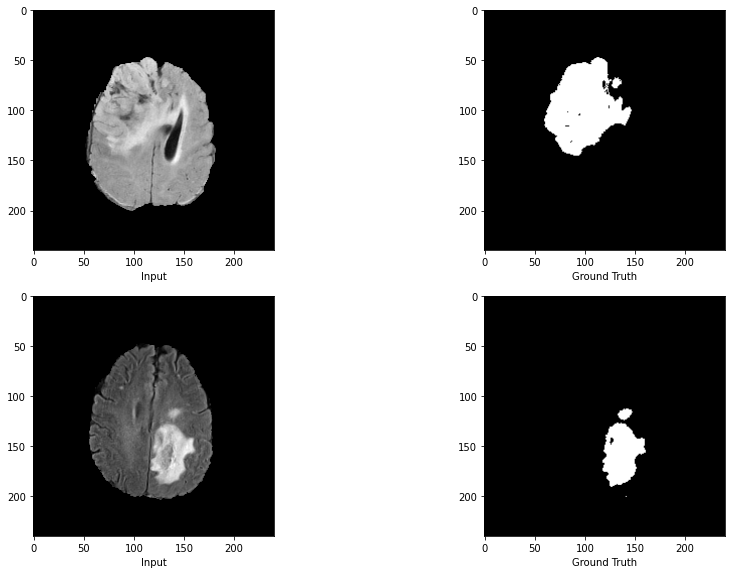

# Brain MRI Image Segmentation
## Winner of the 2021 Imperial College Data Science Challenge
In the [2021 Data Science Institute Computer Vision Challenge](https://www.imperial.ac.uk/data-science/),  we applied semantic image segmentation techniques on magnetic resonance imaging (MRI) to aid the diagnosis of brain tumours. [Prof. Yike Guo](https://www.imperial.ac.uk/people/y.guo), the co-director of the Data Science Institute (DSI), and the DSI judging panel have selected this work as the winner of the **"Best Computer Vision Project"** award. Since our model achieved the highest dice score (78%) in the testing tasks, which uses U-Net architecture with pre-trained VGG16, and was trained on 90% of the available data.

**To provide solutions for real-world applications**, I further developed it into a **Tumor Segmentation API** that can be accessed by doctors and clinicians for effective early screening and diagnosis.

## Dataset
The dataset of brain MRIs from patients with glioma, examples of MRI images and masks are shown below. The dataset can be accessed on Google Drive URL [here](https://drive.google.com/drive/folders/1Y4MUrrfT-Xuos83nOnq8ZWTMZmp9qADH?usp=sharing).

## How to Start 
###  Training the Model

0. Upload `Dataset` to Google Drive, dataset can be accessed [here](https://drive.google.com/drive/folders/1Y4MUrrfT-Xuos83nOnq8ZWTMZmp9qADH?usp=sharing).

1. (Optional) Create an account on [Weights & Biases](https://wandb.ai/site) platform (The training is tracked by `wandb`, this is a tool for tracking and visualising machine learning experiments in real time. If you have an account on Weights & Biases, get started by copying the API key from your profile and ) 

2. Open [notebook](./notebooks/TumorSeg_Winner_U_Net_VGG16.ipynb) in Google Colab

###  API Development 

3
4
5

## Future Work
Exploring more advanced segmentation architectures, such as SLSDeep and SegCaps.

## Contributing
If you have any questions or advice towards this repository, feel free to contact me at xy2119@ic.ac.uk.

Any kind of enhancement or contribution is welcomed!
