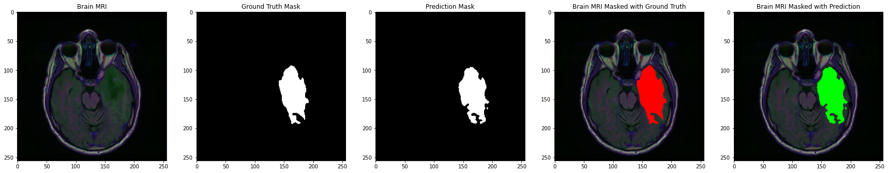
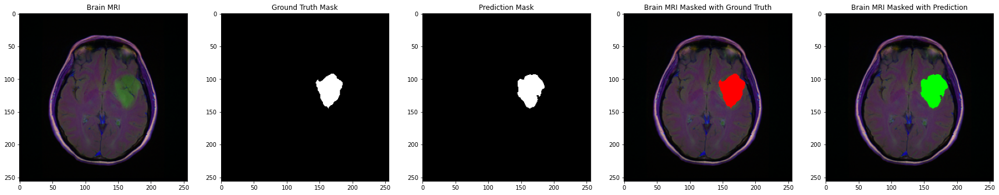
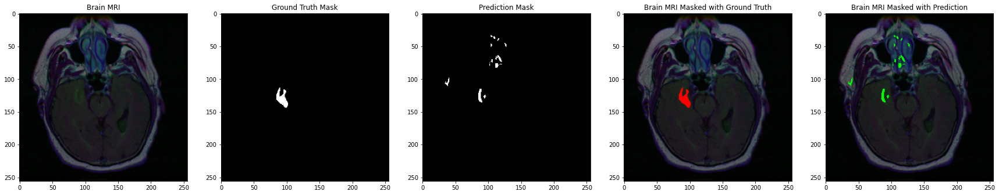

## Notebooks for U-Net Training 

`./TumorSeg_Winner_U_Net_VGG16.ipynb` is the submission notebook to 2021 DSI Challenge. The output is a VGG16 U-Net with dice score ~ 78% on testset, a trained model can be downloaded [here](https://drive.google.com/file/d/1pAMCORzh4bLwOqr-Xkup_id57WKM7AdD/view?usp=sharing).

`./TumorSeg_API_U_Net_VGG19.ipynb` is an improved trainning notebook for Tumor Segmentation API. The output is a VGG19 U-Net with dice score ~ 81% on testset, a trained model can be downloaded [here](https://drive.google.com/file/d/1TElZ-XPhn0Vc41nLx2NJMYaR8CSbhbB1/view?usp=sharing).
Here are examples of the VGG19 U-Net performance 

     Brain MRI    |   Ground Truth Mask   |    Prediction Mask    |    Masked with Ground Truth    |    Masked with Prediction

